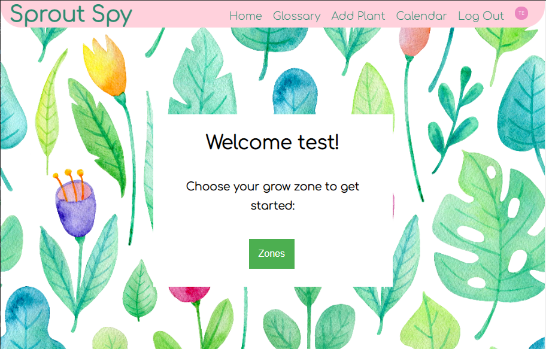
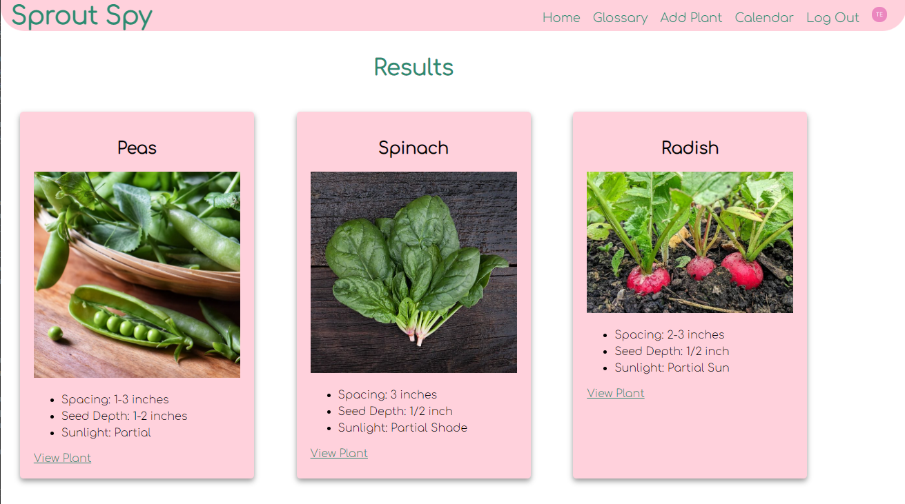
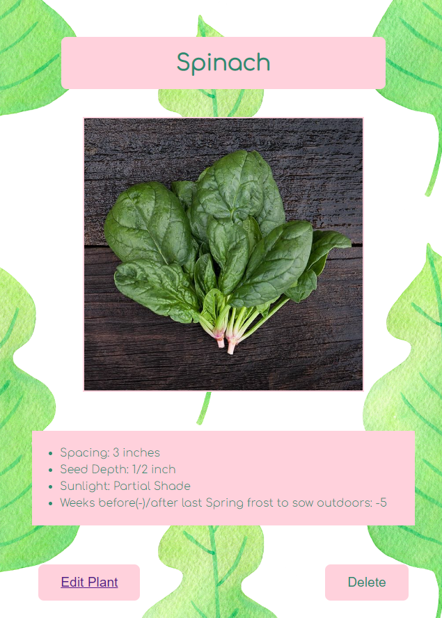
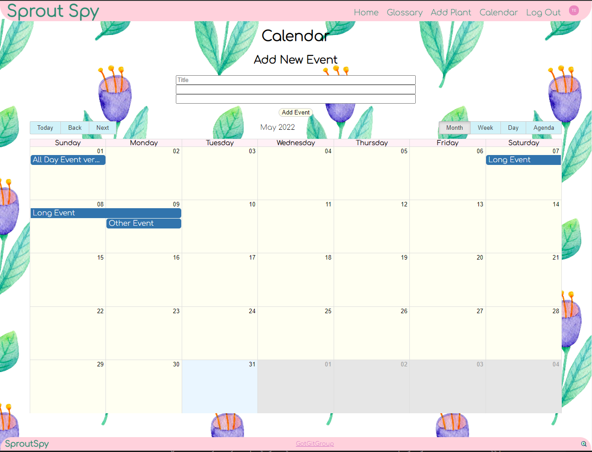

# Sprout Spy 3.0

[](https://sprout-spy.herokuapp.com/)

## Table of contents
* [General info](#general-info)
* [Technologies](#technologies)
* [Screenshot](#Screenshot)
* [Setup](#setup)
* [License](#License)
* [Contact](#Contact)


## General info

Our project, "Sprout Spy", is an application that will help new or future gardeners understand what kinds of seeds and cuttings can be planted in their local
planting zone, as well as search for local public gardens for those who do not have planting space in their area. Our application will also display the day's current weather to plan your trip to your local garden accordingly.


<ins>User Story</ins>

```
AS A novice gardener
I WANT: -to know what plants I can grow near me,
        -to learn the basic planting requirements for each plant
        -to sign up as a new user or login, in order to edit or delete a plant in the database
SO THAT: I can garden with confidence
```
<ins>Acceptance Criteria</ins>

```
GIVEN I am using the Sprout Spy website to learn how to garden, 
WHEN I open the Sprout Spy website, 
THEN I see a drop down menu to select my USDA zone.
WHEN I click a zone, 
THEN I see a results page filled with plants that I can grow in my zone, with details about each plant.
WHEN I click View Plant on a plant result,
THEN a new page opens with more details of that plant. If I am logged in I may edit or delete the plant.
WHEN I click to see results,
THEN I am taken to the results page that lists plants I can grow in my zone.
WHEN I log in or sign up,
THEN the navigation bar changes and when viewing a plant I can edit or remove a plant in the database.
```
	
## Technologies
This project is created with:
* Full MERN Stack
* Auth0 for authentication
* React
* Apollo & GraphQL
* MongoDB & Mongoose
* Heroku
* Express
* Node
* HTML
* CSS & SCSS

## Screenshot






## Setup

Please visit https://github.com/got-git-group/SproutSpy-3.0 to see the repo in Github
<br/>
Please visit https://sprout-spy.herokuapp.com/ to see deployed code through Heroku.

## License

MIT License

Copyright (c) [2022] Sprout Spy

Permission is hereby granted, free of charge, to any person obtaining a copy
of this software and associated documentation files (the "Software"), to deal
in the Software without restriction, including without limitation the rights
to use, copy, modify, merge, publish, distribute, sublicense, and/or sell
copies of the Software, and to permit persons to whom the Software is
furnished to do so, subject to the following conditions:

The above copyright notice and this permission notice shall be included in all
copies or substantial portions of the Software.

THE SOFTWARE IS PROVIDED "AS IS", WITHOUT WARRANTY OF ANY KIND, EXPRESS OR
IMPLIED, INCLUDING BUT NOT LIMITED TO THE WARRANTIES OF MERCHANTABILITY,
FITNESS FOR A PARTICULAR PURPOSE AND NONINFRINGEMENT. IN NO EVENT SHALL THE
AUTHORS OR COPYRIGHT HOLDERS BE LIABLE FOR ANY CLAIM, DAMAGES OR OTHER
LIABILITY, WHETHER IN AN ACTION OF CONTRACT, TORT OR OTHERWISE, ARISING FROM,
OUT OF OR IN CONNECTION WITH THE SOFTWARE OR THE USE OR OTHER DEALINGS IN THE
SOFTWARE.

## Contact

You can contact us using the following links below

| Names                   | Profile                              |
| --------------------    |:-----------------------------------: |
| Samuli Jarvinen         | https://github.com/frye              | 
| Andrew An               | https://github.com/AndyAn7           |
| Erinn Matesi            | https://github.com/ErinnMatesi       |
| Kateryna Tekmenzhi      | https://github.com/KaterynaTekmenzhi |
| Christopher Tidwell     | https://github.com/CLeeTidwell       |
